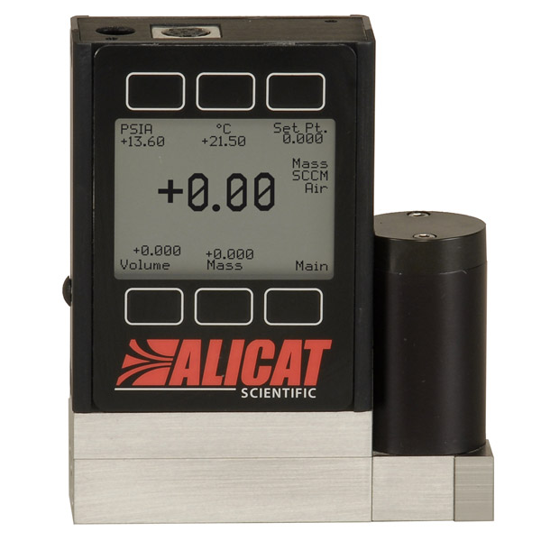

# alicat MFC 



MATLAB class to control Alicat MFCs over a USB port. 

# Usage

Create a MFC object:

```matlab
m = MFC;
```

Look at the values of the P term in the control loop:

```matlab
m.P
```

Set the value of the P term in the control loop to a new value:

```matlab
m.P = 1000;
```

Change the setpoint to 100mL/min

```matlab
m.set_point = 100;
```

View the current (actual) flow rate

```matlab
m.flow_rate
```

View serial number, model number, and other parameters:

```matlab
m = MFC
	MFC with properties:

             port: 'COM3'
              fid: [1x1 serial]
        baud_rate: 19200
        verbosity: 10
             name: 'A'
                P: 1100
                I: 0
                D: 10000
      temperature: []
         pressure: []
        set_point: 0
        flow_rate: []
     model_number: 'MCX-500SCCM-Y'
    serial_number: 91686
    max_flow_rate: 500
````

# Performance 

* Updating flow setpoint: ~8 ms
* Reading default frame: ~9 ms
* Lag between updating setpoint and MFC achieving setpoint (parameter dependent): ~95 ms

# Installation 

Install using my package manager:

```matlab
urlwrite('http://srinivas.gs/install.m','install.m')
install sg-s/alicat-mfc
install sg-s/srinivas.gs_mtools 
```

# License 

[GPL v3](http://gplv3.fsf.org/)